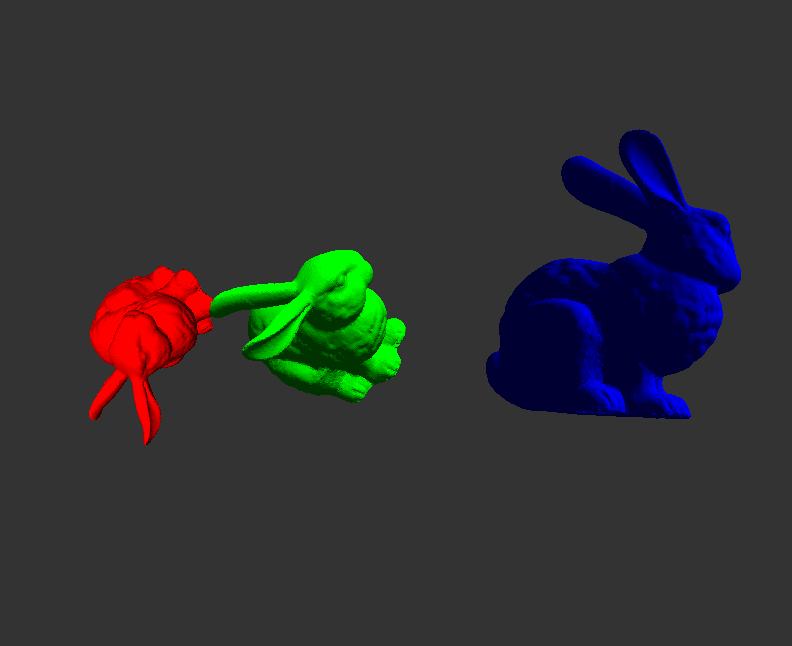

# SteadyAffineTransforms

The is the preliminary implementation of "Steady Affine Motions and Morphs" by Jarek Rossignac paper. Given
a 3D object and the Affinity Matrix A, it calculates the intermediate positions of the model without unexpected
behavior.

In the following image, the "Red" bunny is the source model (at t=0.0). The "Blue" bunny is translated, rotated, 
and scaled (at t = 1.0) The "Green" bunny is the intermediate model at some parameter "t". The Smooth Affine transform
brings the Red bunny towards the blue bunny smoothly and intuitively. With linear and SLERP methods, the intermediate
steps can show some surprises which may be confusing or unintuitive. 

Download Animation [Movie] (./example.mp4)

## Acknowledgemts:
I received great help from Prof. Shizuo Kaji from Kyushu University. He explained me how to use AffineLib library.
Dr. Mayank Singh gave the motivation to develop this code.

## External libraries:
1. AffineLib
2. ICP: (Iterative Closest Points)
3. libQGLViewer

## Compilation:
Presently, there is a Makefile in the distribution which the user needs to modify.
After proper paths to various libraries have been set, just write "make" on the
command line and the executab;e "sam" will be generated.

## Usages:
1. Given a mesh model M, translate and rotate it to some desired position. 
2. Using ICP calculate the Affinity Matrix "A" and store it in "model.xf".
   (icp srcmodel.off dstmodel.off will the 4X4 matrix)
3. Use command line
       sam srcmodel.off model.xf  
4. Press "N" to see the next position of the model.

## License:
LSFA (Let Science be Free for All)
But please find bugs, improve the code and contribute to open-source.
No acknowledgment of this work is required. 

